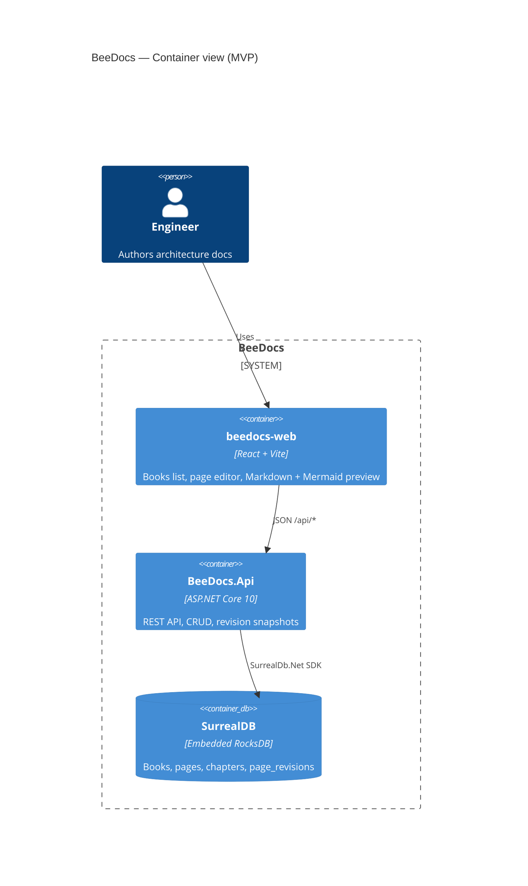

# BeeDocs

Self-hosted documentation platform for software + hardware systems architecture.

MVP: **Books → Pages**, Markdown editor, **Mermaid** (incl. C4-style) diagrams, embedded **SurrealDB (RocksDB)**, **.NET 10** API + **React/Vite** UI.

## Architecture (C4-style)



**Context:** team documentation for systems architecture (C4, networks, hardware inventories — later).

## Project structure

```
BeeDocs/
├── BeeDocs.slnx
├── compose.yml
├── Dockerfile
├── README.md
├── Docs/                     # Human + agent docs (MCP connect guide)
├── k8s/beedocs/              # K3S manifests (NodePort 32095)
├── scripts/deploy-k3s.sh     # build → push → deploy to the K3S server
├── Vibecoding/Instructions.md
└── src/
    ├── BeeDocs.Api/          # .NET 10 minimal API + SurrealDB
    ├── beedocs-web/          # React + Vite + pnpm workspace UI
    └── beedocs-mcp/          # MCP server for AI agents (stdio → API)
```

## MCP (AI agents)

Agents can create books, pages, and diagrams via the Model Context Protocol server.

```bash
cd src/beedocs-mcp && pnpm install && pnpm build
# API must be running on :5080
```

Full setup for Cursor, Claude Desktop, Claude Code, VS Code: **[Docs/MCP-SERVER.md](Docs/MCP-SERVER.md)**  
Tool catalog: **[Docs/MCP-TOOLS.md](Docs/MCP-TOOLS.md)**  
Hosted MCP over HTTP + Cloudflare Access: **[Docs/MCP-HOSTING.md](Docs/MCP-HOSTING.md)**

The server speaks **stdio** (local, default) or **Streamable HTTP** (`MCP_TRANSPORT=http`,
used by the K3S deployment — agents connect to `https://mcp.<domain>/mcp` with no
local install).

## Core entities

| Entity | Purpose |
|--------|---------|
| `Book` | Shelf of related docs |
| `Chapter` | Optional grouping (API ready; UI light) |
| `Page` | Markdown body + version counter |
| `PageRevision` | Snapshot on each update |
| `Diagram` | Model reserved for custom diagram editor |

## Run locally (dev)

**Requirements:** .NET 10 SDK, Node 20+ (22 recommended), pnpm 9 (via corepack or PATH).

### One command

```bash
./scripts/start.sh
```

Starts all three services:

| Service | URL |
|---------|-----|
| API | `http://localhost:5080` (health `/api/health`) |
| Vite UI | `http://localhost:5173` |
| MCP (HTTP) | `http://localhost:5090/mcp` (health `/healthz`, bearer `dev-token`) |

Stops anything already listening on those ports first (safe re-run).  
Ctrl+C stops all three. Logs: `scripts/.logs/`. Optional: `./scripts/stop.sh`.

Override ports: `API_PORT=5081 WEB_PORT=5174 MCP_PORT=5091 ./scripts/start.sh`.  
Skip the MCP process: `SKIP_MCP=1 ./scripts/start.sh` — agents using the **stdio**
transport spawn their own and don't need it running.

Point an agent at the local HTTP server:

```bash
claude mcp add --transport http beedocs-local http://localhost:5090/mcp \
  -H "Authorization: Bearer dev-token"
```

On a fresh clone the first run also installs MCP dependencies and builds it
(`dist/` is gitignored), which adds a few seconds.

### Workspace UI

Single-page professional layout:

| Area | Role |
|------|------|
| **Header** | Brand, breadcrumbs, settings |
| **Left** | Library tree (books → pages / diagrams), resizable & collapsible |
| **Center** | Page/diagram editor canvas |
| **Right** | Context properties & actions, resizable & collapsible |

Open **Settings** for color themes (Honey Light/Dark, Slate, Ocean, Forest, Violet, High contrast), density, and pane reset.

### Manual

```bash
# API (http://localhost:5080)
cd src/BeeDocs.Api
dotnet run

# Web (http://localhost:5173 → proxies /api)
cd src/beedocs-web
pnpm install
pnpm dev
```

Data is stored under `src/BeeDocs.Api/data/surreal` (embedded RocksDB).

## Docker / Podman

```bash
podman compose up --build
# or: docker compose up --build
```

Open http://localhost:8080 (static UI + API; serve static from API after wiring SPA — see next steps if you only run API image).

> Note: the Dockerfile builds API + web assets into `wwwroot`. Production SPA hosting is enabled when the API maps static files (see `Program.cs`).

## Deploy to K3S

BeeDocs runs on the K3S server as a single pod — one ASP.NET Core process serving
the SPA, the API, and uploaded images. SurrealDB is embedded (RocksDB), so there is
no separate database container.

```bash
./scripts/deploy-k3s.sh            # build → push → deploy → status
./scripts/deploy-k3s.sh build      # local podman build only
./scripts/deploy-k3s.sh status     # pods, svc, deploy, pvc
./scripts/deploy-k3s.sh logs       # tail API + MCP logs
./scripts/deploy-k3s.sh shell      # shell into the pod
./scripts/deploy-k3s.sh mcp-token  # print the MCP bearer token
```

| | |
|---|---|
| Namespace | `beedocs` |
| Images | `beecodersregistry.azurecr.io/beedocs` (API + SPA) and `…/beedocs-mcp` (MCP sidecar) |
| **NodePort — web** | **32095** → container `8080` |
| **NodePort — MCP** | **32096** → container `5090` (`/mcp`) |
| Storage | one PVC at `/data` — RocksDB in `/data/surreal`, uploads in `/data/uploads` |
| Health | `GET /api/health` and `GET /healthz` (startup, readiness, and liveness probes) |

Manifests live in [`k8s/beedocs/`](k8s/beedocs/) and are applied by the script.
Overridable via environment: `REGISTRY`, `VPS_IP`, `VPS_USER`, `VPS_BASE_DIR`.

**Cloudflare Tunnel** (configured outside this repo) forwards two hostnames:
`docs.<domain>` → `http://<k3s-node>:32095` and `mcp.<domain>` →
`http://<k3s-node>:32096`. Changing a NodePort means updating the tunnel ingress
rule in lockstep. Access policies and the agent setup are documented in
**[Docs/MCP-HOSTING.md](Docs/MCP-HOSTING.md)** — including the firewall rule that
must block the NodePorts, or Cloudflare Access can be bypassed entirely.

> The deployment is pinned to `replicas: 1` with a `Recreate` strategy on purpose:
> RocksDB holds an exclusive lock on its data directory, so a rolling second pod
> would fail to start.

## API (MVP)

| Method | Path | Description |
|--------|------|-------------|
| GET | `/api/health` | Health check |
| GET/POST | `/api/books` | List / create books |
| GET/PUT/DELETE | `/api/books/{id}` | Book CRUD |
| GET/POST | `/api/books/{bookId}/pages` | List / create pages |
| GET/PUT/DELETE | `/api/pages/{id}` | Page CRUD |
| GET/POST | `/api/books/{bookId}/chapters` | Chapters |
| GET/POST | `/api/books/{bookId}/diagrams` | List / create diagrams |
| GET/PUT/DELETE | `/api/diagrams/{id}` | Diagram CRUD |
| GET | `/api/pages/{pageId}/diagrams` | Diagrams linked to a page |

### BeeDiagram (custom editor)

- Kind `beediagram` stores a JSON document (`nodes`, `edges`, `viewport`).
- Canvas tools: place Box / Person / System / Database / Note, Select+drag, Connect edges, property panel.
- Embed in Markdown pages:

```md
```beediagram-ref
DIAGRAM_ID
```
```

Or inline JSON:

```md
```beediagram
{"version":1,"nodes":[...],"edges":[...]}
```
```

## Next iteration prompts

1. Serve SPA static files from API + SPA fallback route (production single-port).
2. Full-text search across page content.
3. Page history UI (list revisions + diff).
4. AuthN/Z (public read, team edit, admin).
5. Image upload + gallery.
6. Export PDF / Markdown / HTML.
7. Custom diagram editor (own canvas, store as `Diagram`).
8. PlantUML / diagrams.net embed.
9. Hardware inventory templates (BOM, rack, config matrices).
10. Optional Git sync.

## Vibe

Clean BookStack-like UX, minimal bloat, documentation-as-code friendly (Markdown + Mermaid first).
